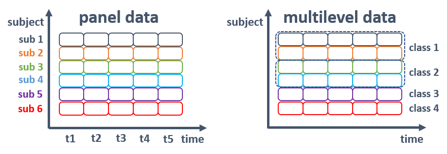

```{r setup, include=FALSE}
knitr::opts_chunk$set(echo = TRUE, message = FALSE, warning = FALSE)
```

# Introduction

In this notebook, we will do some experiments about Time Series Multilevel Models 
beyond the panel data.  
Here is a simple figure which shows the difference of the panel data and the 
multilevel data.  
  


# Libraries
```{r, message=FALSE}
library(tidyverse)
library(CASdatasets)
library(nlme)
library(DT)
library(gridExtra)
```

# Load Data
- In this notebook, we will use a dataset of automobile BIL claims 
(Frees & Wang, 2005) which is a long format data.  

|  Variable  |  Description  |
| ---- | ---- |
|  TOWNCODE  |  The index of Massachusetts towns  |
|  YEAR  |  The calendar year of the observation  |
|  AC  |  Average claims per unit of exposure  |
|  PCI  |  Per-capita income of the town  |
|  PPSM  |  Population per square mile of the town  |

```{r}
data("usmassBI2")
dim(usmassBI2)
datatable(
  usmassBI2,
  options = list(pageLength = 10, 
                 autoWidth = TRUE,
                 scrollX = TRUE,
                 columnDefs = list(list(width = '175px',
                                        targets = seq(1, dim(usmassBI2)[2])))),
  class = 'cell-border stripe'
  )
```

# Split Data into Train and Test
```{r}
train <- usmassBI2 %>% filter(YEAR < 1998)
test <- usmassBI2 %>% filter(YEAR == 1998)
```

# Data Transformation
```{r}
train$YEAR <- as.factor(train$YEAR)
test$YEAR <- as.factor(test$YEAR)
```

# EDA

## YEAR vs Average Claim
```{r, fig.width=10}
train %>% select(YEAR, AC, TOWNCODE) %>% 
  ggplot() +
  geom_line(mapping = aes(
    x = as.numeric(YEAR), y = AC, color = TOWNCODE)) +
  geom_point(mapping = aes(
    x = as.numeric(YEAR), y = AC, color = TOWNCODE)) +
  xlab('YEAR') + ylab('Average Claim')
```

## explanatory var vs Average Claim
```{r, fig.width=10}
train$lnPCI <- log(train$PCI)
train$lnPPSM <- log(train$PPSM)
p1 <- train %>% 
  select(lnPCI, AC, TOWNCODE) %>% 
  ggplot() +
  geom_line(mapping = aes(x = lnPCI, y = AC, color = TOWNCODE)) +
  geom_point(mapping = aes(x = lnPCI, y = AC, color = TOWNCODE)) +
  xlab('log-PCI') + ylab('Average Claim')
p2 <- train %>% 
  select(lnPPSM, AC, TOWNCODE) %>% 
  ggplot() +
  geom_line(mapping = aes(x = lnPPSM, y = AC, color = TOWNCODE)) +
  geom_point(mapping = aes(x = lnPPSM, y = AC, color = TOWNCODE)) +
  xlab('log-PPSM') + ylab('Average Claim')
grid.arrange(p1, p2, nrow = 1)
```

# Linear Models
## Simple LMs
- In this LM, all observations are considered to be independent.  
- We can check the importance of each exploratory variable via **summary** and **anova**  
```{r}
Pool.fit <- lm(formula = AC ~ lnPCI + lnPPSM + YEAR,
               data = train)
summary(Pool.fit)
anova(Pool.fit)
```

## Fixed Effects Models
```{r}
FE.fit <- lm(formula = AC ~ lnPCI + lnPPSM + YEAR + TOWNCODE - 1,
               data = train)
summary(FE.fit)
anova(FE.fit)
```

## Model Comparison using anova function (Pool vs FE)
We will compare 2 models with partial F - test (Chow, 1960).  
Test statistics are formulated with $\mathrm{F}=\frac{(ErrorSS)_{Pooled} - ErrorSS_{FE}}{(n-1)s^2}$  
where $s^2 ( = \sqrt{\frac{38638}{110}}=18.74)$ is **the Residual Standard Error**.  
$(s.e)^2=\frac{\sum{(y_i - \hat{y})^2}}{N-(variable \; DOF)}$  
And F statistics follows an F-distribution with DOF, $df_1=28$ and $df_2=110$.  
We can compute statistics as $F=\frac{52694}{28 \times 18.74^2}=5.3577$.
```{r}
anova(Pool.fit, FE.fit)
```

# Models with Serial Correlation
## Correlation among residuals
```{r}
train$rPool <- resid(Pool.fit)
train %>% 
  select(YEAR, TOWNCODE, rPool) %>%
  reshape(., timevar = "YEAR", idvar = "TOWNCODE", direction = "wide") %>% 
  select(-TOWNCODE) %>% 
  cor(.)
```

## GLS with REML
To relax i.i.d assumption, let's consider a homogeneous model with serial correlation. For subject $i$, the matrix presentation of the model is,  
$y_i=X_i \beta+\epsilon_i$,  
where  
$y_i=(y_{i1}, \; y_{i2}, \; ... , \; y_{iT_i})^T$,  
$\epsilon_i=(\epsilon_{i1}, \; \epsilon_{i2}, \; ... , \; \epsilon_{iT_i})^T$.  
Now we assume that $\epsilon_i$ are correlated with 
$\mathrm{Var}({\epsilon_i})=R_i$.  
This assumption enables to relax i.i.d condition.  
Examples of $\mathrm{R}$ are following,  
  
\begin{equation}
\mathrm{Compound \; Symmetry \; R} = \sigma^2
\begin{bmatrix}
1 &\rho &\rho \\
\rho &1 &\rho \\
\rho &\rho &1
\end{bmatrix}
\end{equation}
  
\begin{equation}
\mathrm{AR(1) \; R} = \sigma^2
\begin{bmatrix}
1 &\rho &\rho^2 \\
\rho &1 &\rho \\
\rho^2 &\rho &1
\end{bmatrix}
\end{equation}

\begin{equation}
\mathrm{Unstructured \; R} = 
\begin{bmatrix}
\sigma^2 &\sigma_{12} &\sigma_{13} \\
\sigma_{12} &\sigma^2 &\sigma_{23} \\
\sigma_{13} &\sigma_{23} &\sigma^2
\end{bmatrix}
\end{equation}
  
Generalized Least Squares (GLS) estimates are obtained by minimizing,  
$\sum^{n}_{i-1}(y_i-X_i\beta)^T \; R_i^{-1} (y_i-X_i\beta)$.  
library `nlme` provides 2 types of likelihood-based methods,  

- Maximum Likelihood  
- REstricted Maximum Likelihood

REML is used to fix downward biased correlation $\mathrm{R}$.  
We will use here `gls()` function to model above 3 types of $\mathrm{R}$.  
The gls function estimates the model under the parameterization 
$\mathrm{R} = \sigma^2 \Sigma$, where $\sigma^2$ is a scale parameter and 
$\Sigma$ is the correlation matrix.  

### Compound Symmetry
```{r}
# Serial Correlation => SC
SCex.fit <- gls(AC ~ lnPCI + lnPPSM + YEAR, 
                data = train,
                correlation = corCompSymm(form = ~ 1 | TOWNCODE))
summary(SCex.fit)
intervals(SCex.fit, which = "var-cov")
getVarCov(SCex.fit)
```

### AR(1)
```{r}
SCar.fit <- gls(AC ~ lnPCI + lnPPSM + YEAR, 
                data = train,
                correlation = corAR1(form = ~ 1 | TOWNCODE))
summary(SCar.fit)
intervals(SCar.fit, which = "var-cov")
getVarCov(SCar.fit)
```

### Unstructured
```{r}
SCun.fit <- gls(AC ~ lnPCI + lnPPSM + YEAR, 
                data = train,
                correlation = corSymm(form = ~ 1 | TOWNCODE))
summary(SCun.fit)
intervals(SCun.fit, which = "var-cov")
getVarCov(SCun.fit)
```

### t-test and F-test
Caution is needed for the tests based on the likelihood function.  
Because the gls default method is `REML`, 
we must set `ML` method to utilize t or F test.
```{r}
SCex.fit.ml <- gls(AC ~ lnPCI + lnPPSM + YEAR,
                   data = train,
                   correlation = corCompSymm(form = ~ 1 | TOWNCODE),
                   method = "ML")
SCar.fit.ml <- gls(AC ~ lnPCI + lnPPSM + YEAR, 
                   data = train,
                   correlation = corAR1(form = ~ 1 | TOWNCODE),
                   method = "ML")
SCun.fit.ml <- gls(AC ~ lnPCI + lnPPSM + YEAR, 
                   data = train,
                   correlation = corSymm(form = ~ 1 | TOWNCODE),
                   method = "ML")
```

The output of `anova` function shows whether more complicated model should be rejected or not.  
`L.Ratio` can be computed through 
$2 \cdot \log \frac{\exp{(LogLik_1)}}{\exp{(LogLik_2)}}$ which follows $\chi^2$ distribution.
```{r}
anova(SCex.fit.ml, Pool.fit)
```


# Linear Mixed-Effects Model ( LME )

LME can be formulated as,  
$y_{it} = z_{it}^T \alpha_i + x_{it}^T \beta + \epsilon_{it}$  
$y_{i} = Z_{i} \alpha_i + X_{i} \beta + \epsilon_{i}$,  
where random effects $\alpha_i$, fixed effects $\beta$.  
In its most general form, we assume that $E(\alpha_i)=0$ and $V(\alpha_i)=D$.  
Furthermore, the subject effects and error term are assumed to be uncorrelated,
$\mathrm{Cov}(\alpha_i, \hat{\epsilon_i})=0$.  
As in the OLS regression, the MLEs of variance component are biased downward.  
To mitigate the bias, employing 
**<font color=deeppink>REstricted Maximum Likelihood</font>** 
as default.  

## Error-components model
Another name is **random intercept model**.  
This model is a special case of LME model 
where $z_{it}=1$  and $V(\epsilon_i)=\sigma^2 I_i$.  
The model becomes,  
$y_it=\alpha_i + x_{it}^T \beta + \epsilon_{it}$  

```{r}
EC.fit <-
  lme(AC ~ lnPCI + lnPPSM + YEAR,
      data = train,
      random = ~ 1 | TOWNCODE)
summary(EC.fit)
intervals(EC.fit, which = "var-cov")
```

A hypothesis test to check whether the subject-specific effects are significant 
or not is,  
  
$H_0 : \sigma^2_\alpha = 0$ , where $\mathrm{V}(\alpha_i)=\sigma^2_\alpha$.  

Here we consider the following procedure,  

* Run the pooled cross-sectional model $y_{it}=x_{it}^T \beta + \epsilon_{it}$
and then calculate residuals $\\e_{it}$  

* For each subject, compute an estimator of $\sigma^2_{\alpha}$,  
$s_i=\frac{1}{T_i (T_i - 1)} \; (T_i^2 \bar{e_i}^2-\sum^{T_i}_{t=1}e_{ti}^2)$  

* Compute test statistic(TS) and compare it with a quantile of an $\chi^2(1)$,  
$\mathrm{TS}=\frac{1}{2n}(\frac{\sum^{n}_{i=1}s_i\sqrt{T_i(T_i-1)}}{N^-1\sum^{n}_{i=1}\sum^{T_i}_{t=1}e_{it}^2})^2$  

```{r}
# Pooling test utilizing train$rPool computed in section 8.1
tcode <- unique(train$TOWNCODE)
n <- length(tcode)
N <- nrow(train)
T <- rep(NA, n)
s <- rep(NA, n)
for (i in 1:n) {
  tmp <- subset(train, TOWNCODE == tcode[i])
  T[i] <- nrow(tmp)
  s[i] <- (sum(tmp$rPool) ^ 2 - sum(tmp$rPool ^ 2)) / T[i] / (T[i] - 1)
}
(TS <- (sum(s * sqrt(T * (T - 1))) * N / sum(train$rPool ^ 2)) ^ 2 / 2 / n)
```
**TS** is enough large to reject the null hypothesis of constant intercept.  

## Error-components model with AR1

```{r}
RE.fit <-
  lme(AC ~ lnPCI + lnPPSM + YEAR,
      data = train,
      random = ~ 1 | TOWNCODE,
      correlation = corAR1(form = ~ 1 | TOWNCODE))
summary(RE.fit)
```
```{r}
intervals(RE.fit, which = "var-cov")
```
* The argument **type = conditional** provides 
the estimate of $\mathrm{R}_i$  
* The argument **type = marginal** provides 
the estimate of $\mathrm{V}_i=Z_iDZ_i^T+R_i$
```{r}
getVarCov(RE.fit)
getVarCov(RE.fit, type = "conditional", individuals = "53")
getVarCov(RE.fit, type = "marginal", individuals = "53")
```

## Likelihood Ratio Test
```{r}
EC.fit.ml <- lme(
  AC ~ lnPCI + lnPPSM + YEAR,
  data = train,
  random = ~ 1 | TOWNCODE,
  method = "ML"
)
RE.fit.ml <- lme(
  AC ~ lnPCI + lnPPSM + YEAR,
  data = train,
  random = ~ 1 | TOWNCODE,
  correlation = corAR1(form = ~ 1 | TOWNCODE),
  method = "ML"
)
```
```{r}
anova(EC.fit.ml, RE.fit.ml)
```

## Hausman Test
```{r}
Var.FE <- vcov(FE.fit)[-(1:n), -(1:n)]
Var.EC <- vcov(EC.fit)[-1, -1]  # exclude intercept
```


# EOF
