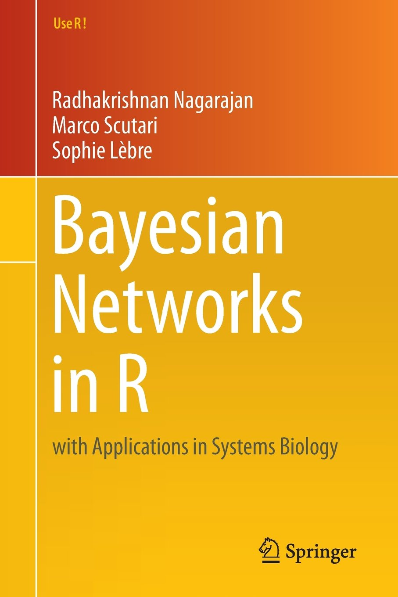

```{r setup, include=FALSE}
knitr::opts_chunk$set(echo = TRUE, message = FALSE, warning = FALSE)
```



# Introduction

There are many packages, **bnlearn**, **deal**, **pcalg** and **catnet**.  
But **bnlearn** will be the 1st choice 
due to its wide variety of structure learning algorithms,
parameter learning approaches, and inference techniques.  
In this notebook, I will do some naive experiments with **bnlearn** package.

# Load Library
```{r}
library(bnlearn)
library(DT)
library(Rgraphviz)
library(parallel)
```

# Load Data
```{r}
data(marks)
str(marks)
datatable(
  marks,
  options = list(pageLength = 10, 
                 autoWidth = TRUE,
                 scrollX = TRUE,
                 columnDefs = list(list(width = '90px',
                                        targets = seq(1, dim(marks)[2])))),
  class = 'cell-border stripe'
  )
```

# Graph

## UnDirected Graph
```{r}
ug <- empty.graph(names(marks))
graphviz.plot(
  ug,
  layout = "fdp",
  highlight = list(nodes = names(marks),
                   col = "gray",
                   textCol = "white",
                   fill = "gray")
)
```

Undirected arcs are represented as their two possible orientations.  
(e.g. "MECH" -> "ALG" and "ALG" -> "MECH")
```{r}
arc.ug <- matrix(c("MECH", "VECT", "MECH", "ALG", "VECT", "MECH",
                     "VECT", "ALG", "ALG", "MECH", "ALG", "VECT",
                     "ALG", "ANL", "ALG", "STAT", "ANL", "ALG",
                     "ANL", "STAT", "STAT", "ALG", "STAT", "ANL"),
                   ncol = 2,
                   byrow = TRUE,
                   dimnames = list(c(1:12), c("from", "to")))
arcs(x = ug) <- arc.ug
## plot.bn
graphviz.plot(
  ug,
  highlight = list(arcs = arc.ug, 
                   nodes = names(marks),
                   col = "gray",
                   textCol = "white",
                   fill = "gray",
                   lwd = 2)
)
ug
```


## Directed Acyclic Graph
### Throughout The Arcs of the Network
```{r}
dag <- empty.graph(names(marks))
arc.dag <- matrix(c("VECT", "MECH",
                     "ALG", "MECH", 
                     "ALG", "VECT",
                     "ANL", "ALG",
                     "STAT", "ALG", 
                     "STAT", "ANL"),
                   ncol = 2,
                   byrow = TRUE,
                   dimnames = list(c(), c("from", "to")))
arcs(dag) <- arc.dag
graphviz.plot(
  dag,
  highlight = list(arcs = arc.dag, 
                   nodes = names(marks),
                   col = "gray",
                   textCol = "white",
                   fill = "gray",
                   lwd = 2)
)
dag
```

### Throughout An Adjacency Matrix
```{r}
mat.dag <- matrix(
  c(0, 1, 1, 0, 0, 0, 0, 1, 0, 0, 0, 0, 
    0, 1, 1, 0, 0, 0, 0, 1, 0, 0, 0, 0, 0),
  nrow = 5, ncol = 5, dimnames = list(nodes(dag), nodes(dag))
)
mat.dag
```
```{r}
dag <- empty.graph(names(marks))
amat(dag) <- mat.dag
graphviz.plot(
  dag,
  highlight = list(arcs = arc.dag, 
                   nodes = names(marks),
                   col = "gray",
                   textCol = "white",
                   fill = "gray",
                   lwd = 2)
)
```

## Investigation the Propaties of Graphs

### node.ordering
```{r}
node.ordering(dag)
# node.ordering(ug)  # return Error
```

### neighborhood (nbr), Markov blanket (mb)
```{r}
nbr(dag, "ALG")
mb(dag, "MECH")
```

### childrean, parents (par)
```{r}
children(dag, "ALG")
parents(dag, "ALG")
```

## Scoring Criteria in Structure Learning
```{r}
bnlearn::score(dag, data = marks, type = "loglik-g")
```
```{r}
dag.eq <- reverse.arc(dag, "STAT", "ANL")
graphviz.plot(
  dag.eq,
  highlight = list(arcs = arc.dag, 
                   nodes = names(marks),
                   col = "gray",
                   textCol = "white",
                   fill = "gray",
                   lwd = 2)
)
all.equal(dag, dag.eq)
```
```{r}
bnlearn::score(dag.eq, data = marks, type = "loglik-g")
```

## V - structure
```{r}
vstructs(dag)
vstructs(dag, moral = TRUE)
```
```{r}
dag2 <- drop.arc(dag, from = "STAT", to = "ANL")
dag3 <- drop.arc(dag, from = "ALG", to = "VECT")
graphviz.plot(
  dag2,
  highlight = list(arcs = arcs(dag2), 
                   nodes = nodes(dag2),
                   col = "gray",
                   textCol = "white",
                   fill = "gray",
                   lwd = 2)
)
graphviz.plot(
  dag3,
  highlight = list(arcs = arcs(dag3), 
                   nodes = nodes(dag3),
                   col = "gray",
                   textCol = "white",
                   fill = "gray",
                   lwd = 2)
)
```

### cpdag
```{r}
dag2.cpdag <- cpdag(dag2)
graphviz.plot(
  dag2.cpdag,
  highlight = list(arcs = arcs(dag2.cpdag), 
                   nodes = nodes(dag2.cpdag),
                   col = "gray",
                   textCol = "white",
                   fill = "gray",
                   lwd = 2)
)
```

### moral
```{r}
dag2.moral <- moral(dag2)
graphviz.plot(
  dag2.moral,
  highlight = list(arcs = arcs(dag2.moral), 
                   nodes = nodes(dag2.moral),
                   col = "gray",
                   textCol = "white",
                   fill = "gray",
                   lwd = 2)
)
```

# Structure Learning
## Grow Shrink Algorithm
* bnlearn can be implemented with parallel processing.
```{r}
cl <- makeCluster(4)
bn.gs <- gs(x = marks, cluster = cl)
graphviz.plot(
  bn.gs,
  highlight = list(arcs = arcs(bn.gs), 
                   nodes = nodes(bn.gs),
                   col = "gray",
                   textCol = "white",
                   fill = "gray",
                   lwd = 2)
)
bn.gs
stopCluster(cl)
# bnlearn::score(bn.gs, data = marks, type = "bic-g")
```

## IAMB Algorithm
```{r}
bn.iamb <- iamb(marks)
graphviz.plot(
  bn.iamb,
  highlight = list(arcs = arcs(bn.iamb), 
                   nodes = nodes(bn.iamb),
                   col = "gray",
                   textCol = "white",
                   fill = "gray",
                   lwd = 2)
)
bn.iamb
```

## hc Algorithm
* Learned structure from `hc` algorithm is the same as 
the ones present in the original model from Whittaker(1990)  
```{r}
bn.hc <- hc(marks, restart = 10)
graphviz.plot(
  bn.hc,
  highlight = list(arcs = arcs(bn.hc), 
                   nodes = nodes(bn.hc),
                   col = "gray",
                   textCol = "white",
                   fill = "gray",
                   lwd = 2)
)
bn.hc
bnlearn::score(bn.hc, data = marks, type = "bic-g")
```

# Parameter Learning
## Continuous Data
### Fit Model
* We can specify which estimator will be used via the `method` argument,
**mle** or **bayes**.  
* Only **mle** can be applicable for continuous data.  
```{r}
fit.hc <- bn.fit(bn.hc, data = marks)
```

### Check Distribution Parameter
```{r}
fit.hc$ALG
```

## Categorical Data
### Discretize Data
```{r}
dmarks <- discretize(marks, method = "interval", breaks = 2)
str(dmarks)
```

### Structure and Parameter Learning
```{r}
bn.hc.d <- hc(dmarks)
graphviz.plot(
  bn.hc.d,
  highlight = list(arcs = arcs(bn.hc.d), 
                   nodes = nodes(bn.hc.d),
                   col = "gray",
                   textCol = "white",
                   fill = "gray",
                   lwd = 2)
)
fit.hc.d <- bn.fit(bn.hc.d, data = dmarks)
```

### Check Discretized Distribution Parameter
```{r}
fit.hc.d$ALG
```


# EOF
